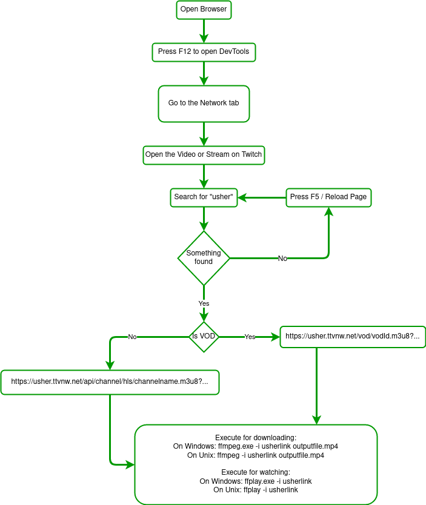

# Welcome to TwitchDownloader!

This Tool is for downloading VODs and livestreams from https://www.twitch.tv/. Commandlinesyntax following below:

# Modes

## Download-Mode
    node index.js download twitch-channel-or-vod-url destination-file.extension
    node index.js d twitch-channel-or-vod-url destination-file.extension
### Windows
    TwitchDownloader.exe download twitch-channel-or-vod-url destination-file.extension
    TwitchDownloader.exe d twitch-channel-or-vod-url destination-file.extension
### Mac OS and Linux
    ./TwitchDownloader download twitch-channel-or-vod-url destination-file.extension
    TwitchDownloader d twitch-channel-or-vod-url destination-file.extension

## Preview-Mode
    node index.js preview twitch-channel-or-vod-url
    node index.js p twitch-channel-or-vod-url
### Windows
    TwitchDownloader.exe preview twitch-channel-or-vod-url
    TwitchDownloader.exe p twitch-channel-or-vod-url
### Mac OS and Linux
    ./TwitchDownloader preview twitch-channel-or-vod-url
    ./TwitchDownloader p twitch-channel-or-vod-url

## Show-URL-Mode
    node index.js show_url twitch-channel-or-vod-url
    node index.js su twitch-channel-or-vod-url
### Windows
    TwitchDownloader.exe show_url twitch-channel-or-vod-url
    TwitchDownloader.exe su twitch-channel-or-vod-url
### Mac OS and Linux
    ./TwitchDownloader show_url twitch-channel-or-vod-url
    ./TwitchDownloader su twitch-channel-or-vod-url

## Copy-Link-Mode
    node index.js copy_url twitch-channel-or-vod-url
    node index.js cu twitch-channel-or-vod-url
### Windows
    TwitchDownloader.exe copy_url twitch-channel-or-vod-url
    TwitchDownloader.exe cu twitch-channel-or-vod-url
### Mac OS and Linux
    ./TwitchDownloader copy_url twitch-channel-or-vod-url
    ./TwitchDownloader cu twitch-channel-or-vod-url
## Play-Audio-Only-Mode
    node index.js play_audio_only twitch-channel-or-vod-url
    node index.js pao twitch-channel-or-vod-url
### Windows
    TwitchDownloader.exe play_audio_only twitch-channel-or-vod-url
    TwitchDownloader.exe pao twitch-channel-or-vod-url
### Mac OS and Linux
    ./TwitchDownloader play_audio_only twitch-channel-or-vod-url
    ./TwitchDownloader pao twitch-channel-or-vod-url
## Play-Video-Only-Mode
    node index.js play_video_only twitch-channel-or-vod-url
    node index.js pvo twitch-channel-or-vod-url
### Windows
    TwitchDownloader.exe play_video_only twitch-channel-or-vod-url
    TwitchDownloader.exe pvo twitch-channel-or-vod-url
### Mac OS and Linux
    ./TwitchDownloader play_video_only twitch-channel-or-vod-url
    ./TwitchDownloader pvo twitch-channel-or-vod-url

# Options
## Hide Usher-URL
    <TwitchLiveDownloader-command> --hide_url
    <TwitchLiveDownloader-command> -hu
## Show Usher-URL (Default)
    <TwitchLiveDownloader-command> --show_url
    <TwitchLiveDownloader-command> -su

## Hide FFMPEG-Banner (Default)
    <TwitchLiveDownloader-command> --hide_banner
    <TwitchLiveDownloader-command> -hb
## Show FFMPEG-Banner
    <TwitchLiveDownloader-command> --show_banner
    <TwitchLiveDownloader-command> -sb

## Wait for Streamer when he/she is offline
    <TwitchLiveDownloader-command> --wait_for
    <TwitchLiveDownloader-command> -wf

# Workflow

